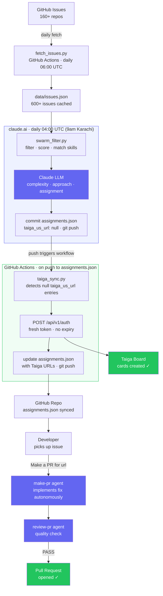

# OpenSwarm

> AI-powered open source issue triage and team assignment pipeline

OpenSwarm is an **agentic workflow** that autonomously discovers, scores, and assigns open source issues to developers — then creates Taiga cards and implements fixes via PR, all without manual intervention.

**Live dashboard:** `https://awais786.github.io/opensource-issues/`

---

## How It Works



**Agents in the system:**

| Agent | Role |
|-------|------|
| `swarm_filter.py` | Data agent — filters 600+ issues down to top candidates |
| Claude LLM | Reasoning agent — complexity analysis, skill matching, fix approach |
| `swarm_assign.py` | Action agent — creates Taiga cards, commits assignments |
| `make-pr` agent | Implementation agent — reads code, writes the fix, opens PR |

Human-in-the-loop only at the **PR review stage**.

---

## Agentic Pipeline

### Fully Automated (GitHub Actions, daily)

```bash
# .github/workflows/swarm.yml
python3 swarm_assign.py --ecosystem all --top 5
```

1. Scans 600+ open issues across 160+ repos
2. Filters, scores, and matches issues to developers by skill
3. Creates Taiga cards via REST API
4. Commits updated `data/assignments.json` back to repo

### Interactive (Claude Code CLI)

```
/swarm              # triage whole team, choose ecosystem
/assign @dev        # assign one issue to a specific dev
/pick-issue         # find best issue for yourself
Make a PR for <url> # implement a fix autonomously
```

---

## Setup

### 1. Fork & clone

```bash
git clone https://github.com/your-handle/opensource-issues.git
```

### 2. Enable GitHub Pages
**Settings → Pages → Source → Deploy from branch: `main`, folder: `/ (root)`**

### 3. Add GitHub secrets for Taiga
**Settings → Secrets and variables → Actions → New repository secret**

| Secret | Value |
|--------|-------|
| `TAIGA_USERNAME` | your Taiga email |
| `TAIGA_PASSWORD` | your Taiga password |

### 4. Trigger the first run
**Actions → Fetch Issues & Update Dashboard → Run workflow**

Fetches issues, builds dashboard, commits data. Runs daily at 06:00 UTC after that.

**Actions → Daily Swarm → Run workflow**

Assigns issues and creates Taiga cards. Runs daily at 04:00 UTC (9am Karachi).

### 5. Customize your team
Edit `data/devs.json` — add developers with their GitHub handles, skills, Taiga IDs, and preferred categories.

### 6. (Optional) Enable Claude Code
Install [Claude Code](https://claude.ai/code) for the interactive agentic workflow (`/swarm`, `/assign`, `make-pr`).

---

## Repository Structure

```
.
├── fetch_issues.py              # GitHub API fetcher
├── build_site.py                # Static site generator
├── swarm_filter.py              # Issue filter + scorer (Python, token-efficient)
├── swarm_assign.py              # Full pipeline: filter → assign → Taiga cards
├── taiga/
│   ├── __init__.py              # Taiga REST API client (dynamic token)
│   └── card.py                  # CLI: create a Taiga user story
├── data/
│   ├── repos.json               # All tracked repos & categories (160+)
│   ├── devs.json                # Team roster with skills and Taiga IDs
│   ├── issues.json              # Fetched issues (auto-generated, 24h TTL)
│   ├── assignments.json         # Assignment history (url, assignee, taiga_us_url)
│   ├── stats.json               # Aggregate statistics
│   └── by_category/             # Issues split by category
├── .github/workflows/
│   ├── fetch-issues.yml         # Daily issue fetch + dashboard build
│   ├── swarm.yml                # Daily swarm: assign issues + create Taiga cards
│   └── deploy-pages.yml         # GitHub Pages deployment
└── .claude/
    ├── commands/
    │   ├── assign.md            # /assign — assign one issue to a dev
    │   └── swarm.md             # /swarm — bulk triage across the team
    └── skills/pick-issue/       # Skill: find the best issue for you personally
```

---

## Commands (Claude Code)

### `/swarm` — Bulk Team Triage

Assigns the best issues across the whole team in one pass. Presents assignments, creates Taiga cards, then prompts for PR implementation.

```
/swarm              # all ecosystems, whole team
/swarm django       # Django ecosystem only
/swarm AI           # AI repos only
/swarm awais786     # one dev only
```

### `/assign` — Single Dev Assignment

Scores and filters issues for one developer, runs guardrails, creates Taiga card.

```
/assign @jawad-khan
/assign @valkrypton bug
/assign @awais786 ai fresh
```

**Guardrails:**

| Rule | Action |
|------|--------|
| Dev not available | BLOCK |
| Dev has ≥ 5 open assignments | BLOCK |
| Issue in dev's avoid list | BLOCK |
| Zero skill overlap | BLOCK |
| Only 1 skill matched | WARN |
| Issue has > 10 comments | WARN |
| Issue not updated in > 30 days | WARN |

### `/pick-issue` — Personal Issue Finder

Finds clean, unassigned issues tailored to your profile. Verifies each issue is open and has no in-progress PR.

```
/pick-issue           # default ecosystem
/pick-issue django    # Django/Python repos
/pick-issue AI        # LiteLLM, LangChain, LlamaIndex, Chroma, MCP
```

### `make-pr` — Autonomous PR Implementation

Give it an issue URL — it reads the codebase, implements the fix, and hands off push commands.

```
Make a PR for https://github.com/owner/repo/issues/123
```

1. Validates issue is open and unassigned
2. Forks/clones repo, creates feature branch
3. Explores codebase, implements minimal fix
4. Runs `review-pr` agent for quality check
5. Commits and hands off `git push` to you

---

## Raw JSON API

All data files are publicly accessible via GitHub Pages:

| File | URL |
|------|-----|
| All issues | `/data/issues.json` |
| Stats | `/data/stats.json` |
| By repo | `/data/issues_by_repo.json` |
| Repo list | `/data/repos.json` |
| Assignments | `/data/assignments.json` |

---

## Ecosystems Tracked

28 categories across 5 ecosystems: **Django · Python · React · Rust · AI**

160+ repos including Django, CPython, Mypy, FastAPI, Ruff, uv, React, Next.js, Rust, Tokio, LiteLLM, LangChain, LlamaIndex, Chroma, and more.

---

## Local Development

```bash
# Fetch fresh issue data
GITHUB_TOKEN=your_token python3 fetch_issues.py

# Build static site from cached data
python3 build_site.py

# Run swarm locally (filter + assign + Taiga cards)
python3 swarm_assign.py --ecosystem all --top 5

# Open dashboard
open index.html
```

---

## Contributing

PRs welcome:
- Add repos to `data/repos.json`
- Improve scoring logic in `swarm_filter.py`
- Improve the dashboard (`build_site.py`)
- Add new Claude Code commands in `.claude/commands/`
